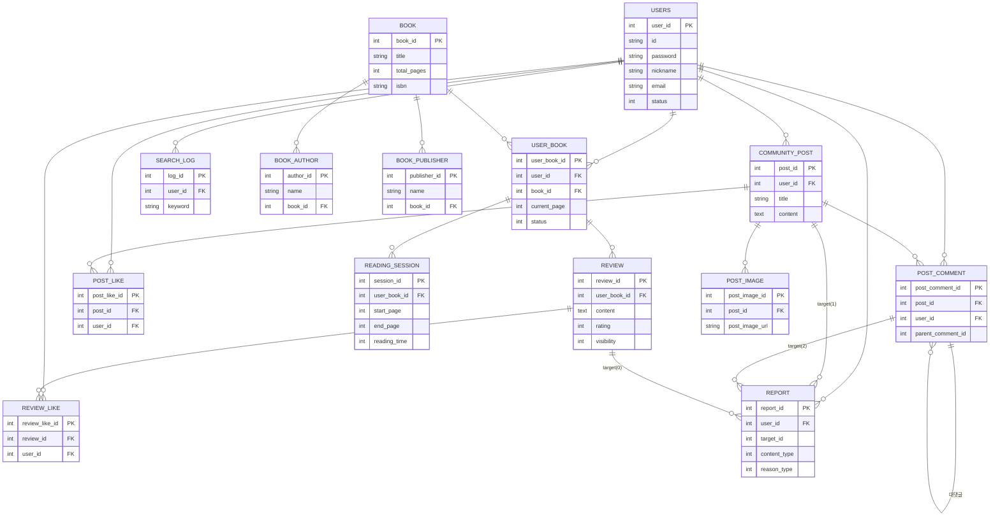

# 📚 TALKSEO (톡서)

**읽은 책이 쌓이는 기록, 함께 나누는 독서 습관**

독서 타이머 · 감상평 · 커뮤니티까지 이어지는 독서 경험을 한곳에서


## ✨ TALKSEO란?

**TALKSEO(톡서)** 는 독서 과정을 기록하고 시각화하며, 커뮤니티를 통해 독서 경험을 나누는 iOS 앱입니다. 독서 타이머로 실시간 독서 시간을 기록하고, 도서별 감상평을 남기고, 완독 기록을 통계로 확인할 수 있습니다.

3인 팀 프로젝트로, 로그인/회원가입, 독서 타이머, 도서 상세, 커뮤니티 하단 네비게이션, 마이페이지, 스플래시 화면을 담당했습니다.

## 🎯 핵심 기능

| | 기능 |
|---|---|
| ⏱ | 실시간 독서 타이머로 시작~종료 페이지, 독서 시간 기록 |
| 🔍 | 도서 검색부터 상세 정보, 완독 도서 상세까지 확인 |
| ✍️ | 감상평 작성 및 나만의 독서 기록 관리 |
| 💬 | 커뮤니티에 글 작성 · 댓글 · 좋아요로 독서 경험 공유 |
| 👤 | 마이페이지에서 완독 기록 및 프로필 관리 |

## 📱 화면 미리보기

### 스플래시


### 로그인 / 회원가입


### 독서 타이머


### 도서 상세


## 🧑‍🤝‍🧑 팀원 및 역할

| 이름 | 담당 |
|---|---|
| 고정은 | 로그인/회원가입/프로필, 커뮤니티, 설정 |
| 곽가린 | 로그인/회원가입, 독서 타이머, 도서 상세, 커뮤니티 하단바, 마이페이지, 스플래시, DB 설계 |
| 김한나 | 도서 검색/상세, 기록 작성, 커뮤니티 글 작성 |

## 🏗 시스템 구조

### 📁 프로젝트 구조

```
Talkseo/
├── Php/                          # 백엔드 API (로그인, 도서, 독서 세션, 커뮤니티, 좋아요/신고)
├── talkseo/
│   ├── talkseo.xcodeproj/
│   └── talkseo/                  # SwiftUI 화면
│       ├── LoginView.swift / SignUpView.swift
│       ├── BookTimerView.swift / BookWriteView.swift / SaveBookView.swift
│       ├── SearchBookView.swift / SearchDetailView.swift / DetailBookView.swift
│       ├── CommunityView.swift / ComuWriteView.swift / ComuDetailView.swift
│       └── MyPageView.swift / BotNav.swift / RootView.swift / MainView.swift
├── TALKSEO_ERD/                  # ERD 설계 문서
├── TALKSEO_CLASS/                 # 클래스 다이어그램
└── README.md
```

### 🗄 DB 주요 테이블

| 테이블 | 설명 |
|---|---|
| `USERS` | 사용자 정보 |
| `BOOK` / `BOOK_AUTHOR` / `BOOK_PUBLISHER` | 도서 정보 |
| `USER_BOOK` | 사용자별 독서 상태 (읽기 전 / 읽는 중 / 중단 / 완료) |
| `READING_SESSION` | 독서 세션 기록 (시작/종료 페이지, 독서 시간) |
| `REVIEW` / `REVIEW_LIKE` | 감상평 및 좋아요 |
| `COMMUNITY_POST` / `POST_COMMENT` / `POST_IMAGE` / `POST_LIKE` | 커뮤니티 글/댓글/이미지/좋아요 |
| `SEARCH_LOG` / `REPORT` | 검색 로그 및 신고 |

> `status`: 0-보임, 1-안보임, 2-삭제 (테이블별로 상이) · `USER_BOOK.status`: 0-읽기 전, 1-읽는 중, 2-중단, 3-삭제/취소, 4-완료

### 🗂 ERD



## 🛠 기술 스택

| 영역 | 기술 |
|---|---|
| Frontend | Swift · SwiftUI (Xcode) |
| Backend | PHP |
| Database | MySQL |

## 🚀 시작하기 (Local Development)

### 사전 요구사항

- Xcode (iOS 시뮬레이터)
- PHP + MySQL (XAMPP / MAMP 등)

### 백엔드 (PHP + MySQL)

```bash
# XAMPP/MAMP 등으로 PHP + MySQL 실행 후
# Php/ 폴더를 웹 서버 루트에 배치
# Php/db.php에 DB 접속 정보(호스트/계정/DB명) 설정
```

### iOS 앱

```bash
open talkseo/talkseo.xcodeproj
```

Xcode에서 시뮬레이터를 선택해 실행합니다. 백엔드 API 주소는 앱 내 네트워크 요청 부분에서 로컬 서버 주소로 맞춰야 합니다.

## 📡 주요 API

`Php/` 폴더의 각 파일이 하나의 엔드포인트입니다 (예: `login.php` → `POST /Php/login.php`).

| Method | Endpoint | 설명 |
|---|---|---|
| POST | `login.php` | 로그인 (id, password 확인) |
| POST | `signup.php` | 회원가입 |
| POST | `book.php` | 도서 목록/검색 |
| POST | `book_detail.php` | 도서 상세 |
| GET | `start_session.php` | 독서 세션 시작 |
| GET | `end_session.php` | 독서 세션 종료 |
| GET | `save_session.php` | 독서 세션 저장 |
| GET | `get_session.php` | 독서 세션 조회 |
| GET/POST | `insert_user_book.php` | 사용자 도서 상태 등록 |
| GET | `record_books.php` / `complete_book.php` / `get_completed_books.php` | 독서 기록 조회 · 완독 처리 · 완독 목록 |
| POST | `review_save.php` / `review_list.php` / `review_like.php` | 감상평 작성 · 목록 · 좋아요 |
| POST | `comu.php` / `comu_write.php` / `comudetail.php` / `comu_update.php` | 커뮤니티 글 목록 · 작성 · 상세 · 수정 |
| POST | `comu_comment_insert.php` / `comu_comment_delete.php` / `comu_like.php` | 댓글 작성/삭제 · 좋아요 |
| GET | `profile.php` / `get_user_info.php` / `my_page.php` | 프로필 및 사용자 정보 관리 |

> `chekId.php`는 코드상 `login.php`와 동일하게 id+password를 확인하는 로직이라 표에서 제외했습니다.

## 📚 문서

| 문서 | 내용 |
|---|---|
| `TALKSEO_ERD/` | ERD 설계 문서 |
| `TALKSEO_CLASS/` | 클래스 다이어그램 |
| `Talkseo_기획서.pdf` | 기획 문서 |
| `Talkseo_쿼리.pdf` | 전체 SQL 쿼리 원본 |
